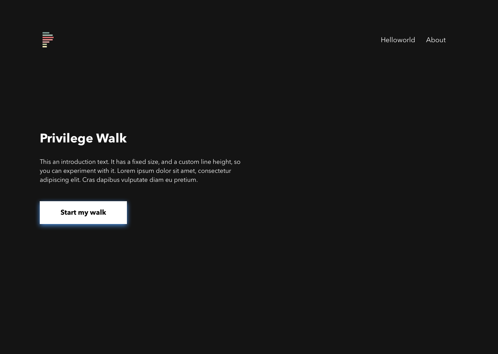
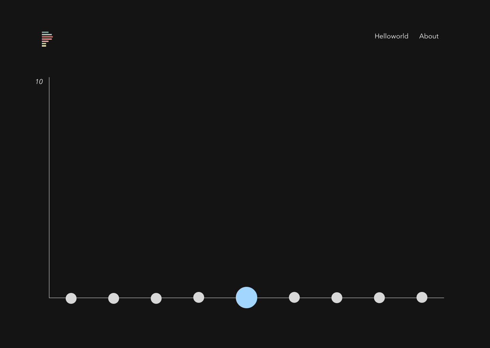
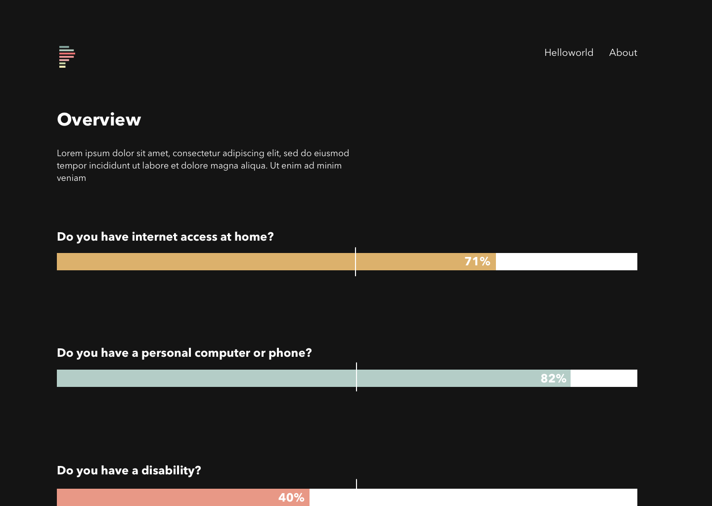

#  Privileged

This app was made during nwHacks 2018.

## Proposal

A web application for conducting a ‘privilege walk’. The questions are tailored towards the tech community in North America.

## Social Issue

The Privilege of Not Understanding Privilege.

## Install

1. `git clone https://github.com/FlyteWizard/whatthetech.git`
2. `npm install`
3. `npm start`
4. visit http://localhost:3000/

## Links

The demo app can be found here: [Privileged](http://www.privileged.tech)

* [Devpost](https://devpost.com/software/privileged)
* [Github](https://github.com/FlyteWizard/whatthetech)

---

### Resources

* https://edge.psu.edu/workshops/mc/power/privilegewalk.shtml
* https://hackernoon.com/tech-your-privilege-at-the-door-5d8da0c41c6b
* https://www.psychologytoday.com/blog/feeling-our-way/201702/the-privilege-not-understanding-privilege

### Contributors

* [Amy Hanvoravongchai](https://github.com/amyhanv)
* [Dominique Charlebois](https://github.com/FlyteWizard)
* [Macguire Rintoul](https://github.com/mrintoul)
* [Sophia Chan](https://github.com/schan27)

### Application Screenshots

#### Landing Page

#### Start Page

#### Walk Page

#### Question Page

### End Page

