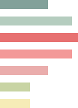
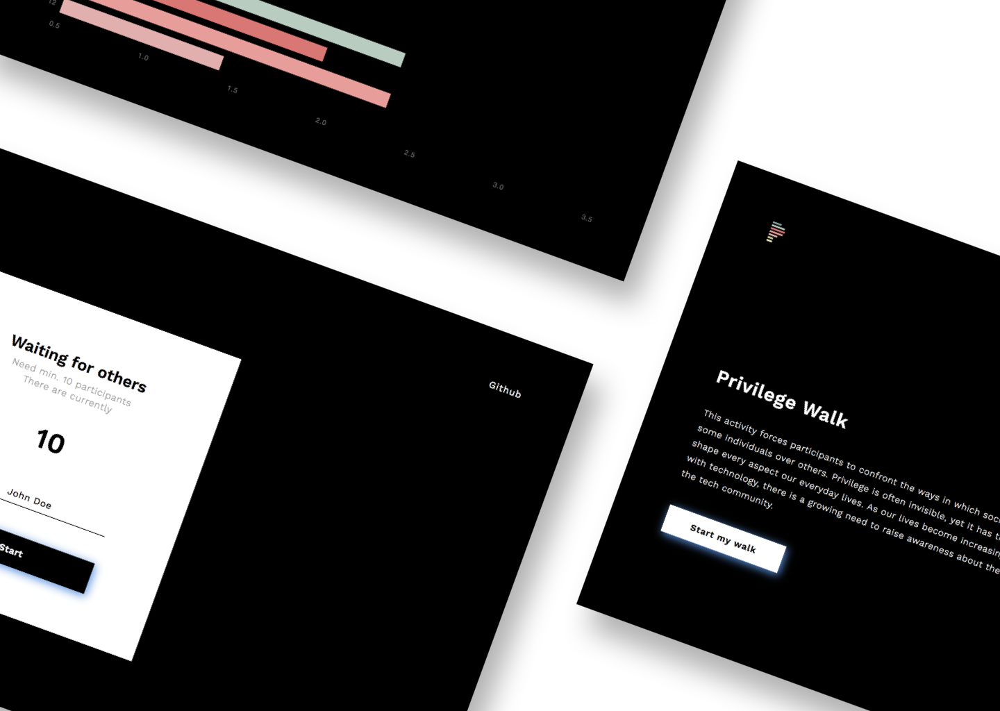
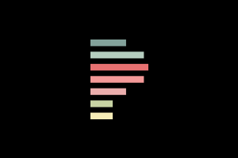
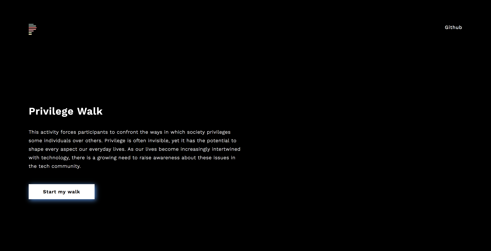
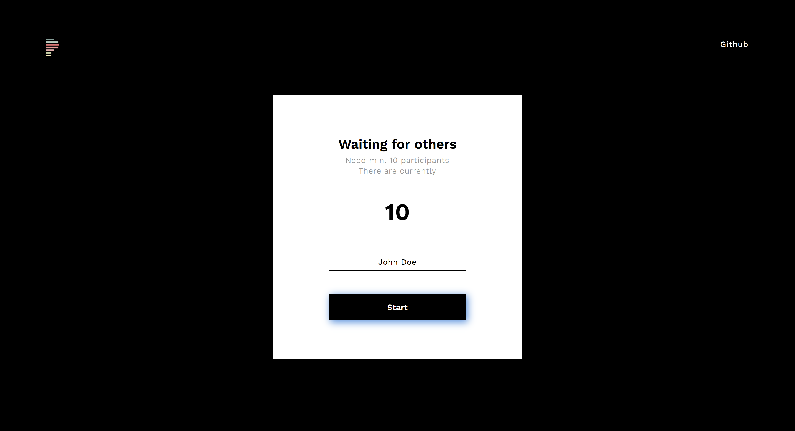
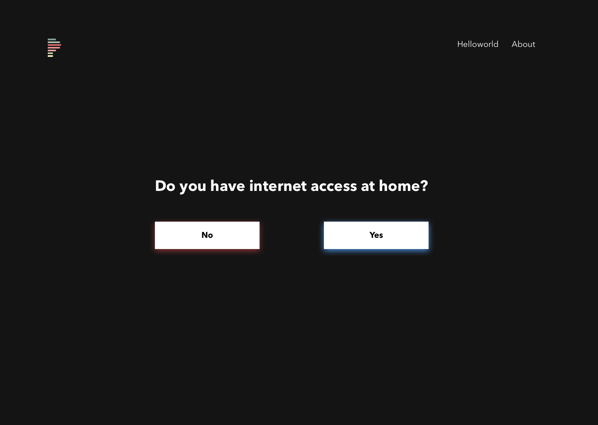

#  Privileged

This app was made during nwHacks 2018.

## Social Issue

The Privilege of Not Understanding Privilege.

## Proposal

Privileged.tech is a web application that enables groups of individuals to conduct a [‘privilege walk’](https://edge.psu.edu/workshops/mc/power/privilegewalk.shtml) from their web-connected devices in real time along with the other members of the group. The questions in the walk aim to expose the privileges present in the tech community, and provoke participants to reflect on their position in the walk. Privileged.tech encourages the more privileged participants to not only acknowledge, but to also engage those privileges and work toward improving the atmosphere of the industry. The project also provides relevant stories and promotes other projects with the same vision.

## Use Cases

We imagine the project being used in university lectures or workplace teams as an introduction to understanding privilege. Since the app connects the group's responses in real-time, it facilitates a digital version of a real privilege walk.

## Install

1. `git clone https://github.com/FlyteWizard/whatthetech.git`
2. `npm install`
3. `npm start`
4. visit http://localhost:3000/

## Links

The demo app can be found here: [Privileged](http://www.privileged.tech)

* [Devpost](https://devpost.com/software/privileged)
* [Github](https://github.com/FlyteWizard/whatthetech)

---

### Resources

* https://edge.psu.edu/workshops/mc/power/privilegewalk.shtml
* https://hackernoon.com/tech-your-privilege-at-the-door-5d8da0c41c6b
* https://www.psychologytoday.com/blog/feeling-our-way/201702/the-privilege-not-understanding-privilege

### Contributors

* [Amy Hanvoravongchai](https://github.com/amyhanv)
* [Dominique Charlebois](https://github.com/FlyteWizard)
* [Macguire Rintoul](https://github.com/mrintoul)
* [Sophia Chan](https://github.com/schan27)

### Application Screenshots

#### Thumbnail Page

#### Landing Page

#### Start Page

#### Question Page

