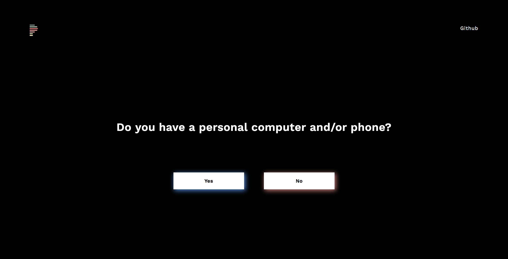

#  Privileged

This app was made during nwHacks 2018.

## Proposal

A web application for conducting a ‘privilege walk’.

## Social Issue

A lack of awareness of privilege?? [citation needed].

### Install

1. Clone Repo
2. `npm install`
3. `npm firebase`
4. `npm router-react-dom`
5. `npm start`
6. visit http://localhost:3000/

### Resources

* https://edge.psu.edu/workshops/mc/power/privilegewalk.shtml
* https://hackernoon.com/tech-your-privilege-at-the-door-5d8da0c41c6b

### Contributors

* Amy
* Dominique
* Macguire
* Sophia

### Links

The demo app can be found here: [Privileged](http://www.privileged.tech)

* [Devpost]()
* [Github](https://github.com/FlyteWizard/whatthetech)

### Application Screenshots

#### Landing Page

#### Start Page

#### Walk Page

#### Question Page

### End Page

